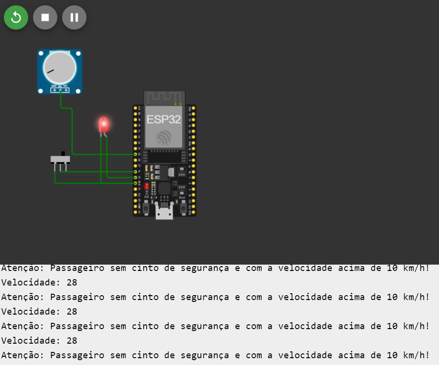

## Protótipo de sistema de alarme para o cinto de segurança de um carro.
### O sistema é capaz de detectar se o passageiro está ou não usando o cinto de segurança, implementando este sistema de alarme ao ESP32 e sensores/atuadores disponíveis na plataforma de simulação Wokwi.

> se o passageiro não estiver usando o cinto de segurança e a velocidade do carro for superior a 10 km/h, um alarme será acionado para o motorista.

